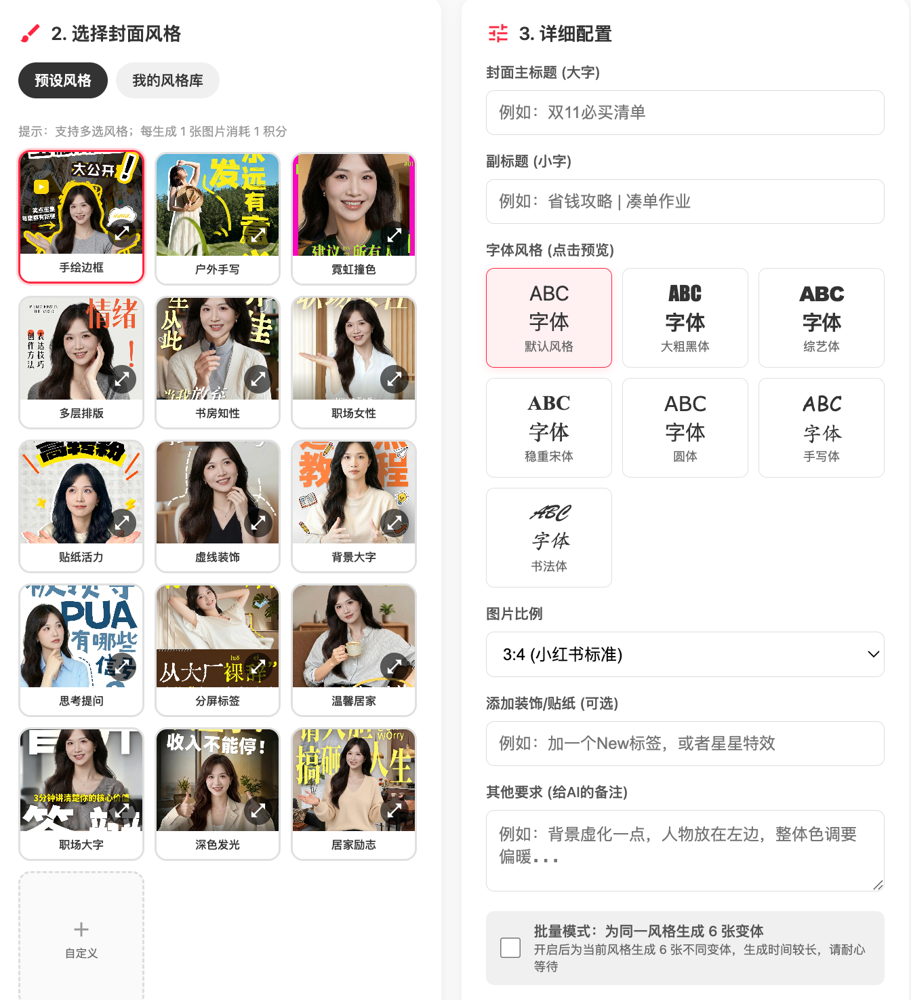

# 小红书封面生成器 - Claude Code Skill

在命令行直接生成小红书封面图片，无需打开网站。

**官网**：[xhscover.vivi.wiki](https://xhscover.vivi.wiki)（可在线预览所有风格效果图）

---

## 效果预览

支持 18 种预设风格，覆盖职场、居家、综艺、文艺等各类场景：



> 在命令行选择风格后，Skill 会自动完成上图中所有配置步骤，直接输出封面图片。
> 完整风格效果图可在 [xhscover.vivi.wiki](https://xhscover.vivi.wiki) 预览。

---

## 前置要求

- [Claude Code](https://claude.ai/code) CLI 已安装
- Node.js 18+（macOS / Linux / Windows 均支持）

---

## 安装

```bash
# 1. 克隆到 Claude Code Skills 目录
git clone https://github.com/Vivixiao980/xhs-cover-skill ~/.claude/skills/xhs-cover
```

重启 Claude Code 后，Skill 自动生效。

---

## 使用方法

在 Claude Code 中输入任意触发词即可：

```
生成封面
小红书封面
制作封面
xhs封面
```

**首次使用**会引导你完成 API 配置（约 2 分钟）。

---

## API 配置

### 方案 A：Google AI Studio（推荐，免费）

1. 访问 [aistudio.google.com/apikey](https://aistudio.google.com/apikey) 创建 API Key
2. 在 Skill Onboarding 中选择「Google AI Studio」，粘贴 Key 即可

> 免费额度：每分钟 15 次请求，足够个人使用。需要科学上网。

### 方案 B：第三方 API 代理

支持 [VectorEngine](https://api.vectorengine.ai)、Cloudsway 等兼容 OpenAI 格式的代理服务。无需科学上网，按量付费。

配置文件保存在 `~/.config/xhs-cover/config.json`：

```json
{
  "apiType": "google",
  "apiKey": "AIza...",
  "apiEndpoint": "https://generativelanguage.googleapis.com/v1beta/openai/chat/completions",
  "model": "gemini-2.0-flash-exp-image-generation",
  "outputDir": "~/Desktop/XHS封面",
  "defaultAspectRatio": "3:4"
}
```

---

## 命令行直接使用

也可以绕过 Skill，直接调用脚本：

```bash
node ~/.claude/skills/xhs-cover/scripts/generate.mjs \
  --image "/path/to/photo.jpg" \
  --style "hand-drawn-border" \
  --title "你的封面大标题" \
  --subtitle "副标题（可选）" \
  --aspect-ratio "3:4" \
  --count 1
```

**支持的参数：**

| 参数 | 说明 | 默认值 |
|------|------|--------|
| `--image` | 人物照片路径（必填） | - |
| `--style` | 风格ID（必填，见下方列表） | - |
| `--title` | 主标题（必填） | - |
| `--subtitle` | 副标题 | 空 |
| `--extra` | 额外要求 | 空 |
| `--count` | 生成数量（最多5） | 1 |
| `--aspect-ratio` | 比例：3:4 / 1:1 / 9:16 / 4:3 | 3:4 |
| `--output-dir` | 保存目录 | ~/Desktop/XHS封面 |
| `--api-key` | API Key | 读配置文件 |
| `--base-url` | API Base URL | 读配置文件 |
| `--api-endpoint` | 完整端点URL（Google适用） | 读配置文件 |
| `--model` | 模型名称 | 读配置文件 |
| `--rotate` | 手动旋转：90/180/270 | 自动EXIF |
| `--no-auto-orient` | 跳过EXIF自动旋转 | false |
| `--test` | 只测试API连通性 | false |

---

## 风格列表

| | | |
|---|---|---|
|  |  |  |
| **手绘边框** `hand-drawn-border` | **户外手写** `outdoor-handwriting` | **霓虹撞色** `neon-contrast` |
| 黄色手绘描边，综艺活力感 | 竖排毛笔黄字，清新自由感 | 荧光粉绿大胆撞色，Y2K潮流 |
|  |  |  |
| **多层排版** `multi-layer-layout` | **书房知性** `study-room-intellectual` | **职场女性** `professional-woman` |
| 黑橙混排，杂志编辑风格 | 奶油色手写字，温暖智慧感 | 奶黄大字+红色虚线，赋能感 |
|  |  |  |
| **贴纸活力** `sticker-energy` | **虚线装饰** `dashed-decoration` | **背景大字** `background-big-text` |
| 人物抠图贴纸效果，闪电星星装饰 | 白字橙副标，虚线半圆环绕 | 超大橙字作背景，人物前景 |
|  |  |  |
| **思考提问** `thinking-question` | **分屏标签** `split-screen-tags` | **温馨居家** `cozy-home` |
| 蓝灰毛笔字，问号设计 | 上图下色块，黄蓝配色 | 黄白渐变字+椭圆高亮 |
|  |  |  |
| **职场大字** `workplace-big-text` | **深色发光** `dark-glow` | **居家励志** `home-motivation` |
| 白色超大字叠人物，冲击力 | 深色背景+黄色发光文字 | 亮黄大字，开放姿势场景 |
|  |  |  |
| **黄粉横幅** `yellow-pink-banner` | **粉黄俏皮** `pink-yellow-playful` | **专业简洁** `professional-clean` |
| 黄字顶部+粉色横幅底部 | 波浪英文+手写中文，可爱 | 白字简洁，现代办公场景 |

---

## 注意事项

- 图片会自动读取 EXIF 方向信息并旋转（手机拍摄的竖版照片无需手动处理）
- 图片超过 4MB 会自动压缩
- 建议每次生成间隔 8 秒以上，避免 API 连接问题
- 生成耗时约 30-60 秒

---

## 贡献指南

欢迎提交 PR！以下几类贡献特别受欢迎：

### 新增风格
在 `scripts/generate.mjs` 的 `STYLES` 对象中添加一个新 key，包含：
- `name`：风格中文名
- `prompt`：详细的中文设计提示词

参考现有风格格式，确保包含【布局要求】【文字样式】【核心特效】【禁止事项】【氛围】几个区块。

### 改进现有提示词
如果你发现某个风格生成效果不好（比如文字乱码、构图不对），欢迎直接修改对应的 `prompt` 并附上改进前后的对比截图。

### 其他贡献
- 增加新的图片处理功能（如自动抠图、滤镜）
- 支持更多 API 提供商
- 改进 Onboarding 流程
- 修复 Bug

提交 PR 前请简单描述改动内容，如有效果图更好！

---

## License

MIT — 作者：[Vivi](https://xhscover.vivi.wiki)
